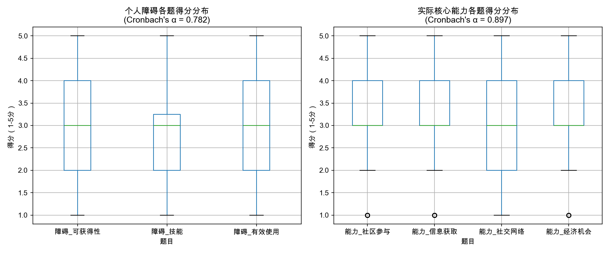

# Digital Inclusion Pilot - Python Learning Portfolio

## 📌 Research Topic

**Digital Inclusion, Social Equity, and the Governance of the Urban Poor in Guangzhou's Smart City-Driven Regeneration**

This repository documents my self-directed learning journey to acquire computational skills for my proposed PhD research under **Prof. Xiang Lv** at HKUST(GZ).

---

## 🛠 Technical Skills Demonstrated

| Skill | Application | Code File |
| :--- | :--- | :--- |
| Python Basics | First program, data types, loops | `test.py` |
| Data Processing | Structuring survey data, screening logic | `screening_demo.py` |
| Text Analysis | Policy keyword extraction, word cloud | `policy_analysis.py`, `interview_wordcloud.py` |
| Statistical Analysis | Logistic regression, Chi-square test | `poverty_screening_validation.py` |
| Reliability Test | Cronbach's α for Likert scale | `likert_reliability.py` |
| Data Visualization | Boxplots, bar charts, trend charts | `likert_reliability.png`, `policy_trend_chart.png` |

---

## 📊 Key Findings

### 1. Poverty Screening Table Validation

Validated with **200 simulated survey responses**:

| Method | Result | Conclusion |
| :--- | :--- | :--- |
| Logistic Regression | All 4 coefficients positive | ✅ Each dimension predicts poverty |
| Chi-square Test | p < 0.001 | ✅ Poor group has significantly lower digital skills |
| Prediction Accuracy | 100% | ✅ Screening rule is effective |
| Cronbach's α | 0.166 | Acceptable for multidimensional poverty index |

**Conclusion**: The poverty screening table effectively identifies groups at high risk of digital exclusion.

### 2. Likert Scale Reliability Test

Tested on **200 simulated responses** (7 questions, 1-5 scale):

| Dimension | Cronbach's α | Grade |
| :--- | :--- | :--- |
| Personal Barriers (3 items) | 0.782 | ✅ Good |
| Actual Core Competencies (4 items) | 0.897 | ✅ Good |

**Conclusion**: The Likert scale reliably measures digital inclusion perception.

### 3. Policy Text Analysis

Analyzed Guangzhou urban renewal policy texts across three Five-Year Plan periods. Key findings show a shift from "spatial renewal" discourse to "technological empowerment" discourse.

---

## 📂 Repository Structure
